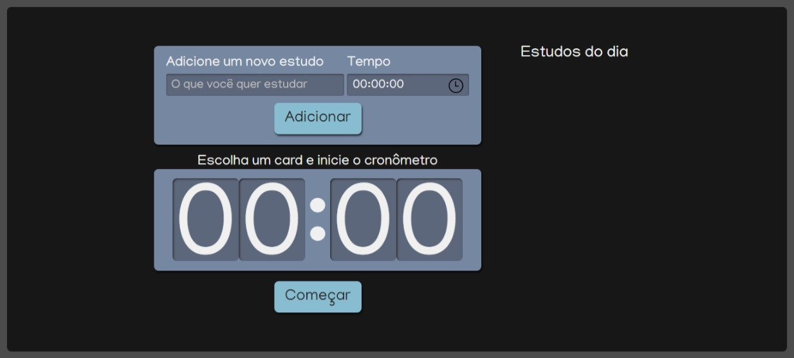

# Alura Studies

O Alura Studies é uma aplicação desenvolvida no curso <a href="https://cursos.alura.com.br/course/react-modernizando-escrever-typescript" target="_blank">React: escrevendo com Typescript</a>. 
Foi pensado para:
- Entender conceitos de React como Componentização, Props e State
- Evitar sobreposições de CSS com CSS Modules
- Aprender sobre os hooks useState e useEffect e entenda como eles eram usados nos class components
- Deixar o código mais limpo e documentado com a forma mais atual de se escrever React
- Desenvolver o código com conceitos de boas práticas como DRY (Don't repeat yourself) e SRP (Single Responsibility Principle)

## 🔨 Funcionalidades do projeto

O projeto foi baseado no método Pomodoro, isto é, nós criamos as tarefas e determinamos o tempo de cada uma.

Em seguida selecionamos a tarefa e apertamos em "Começar", a partir deste momento, o temporizador starta.

## ✔️ Técnicas e tecnologias utilizadas

Se liga nessa lista de tudo que usaremos nessa formação:

- `React`
- `React Hooks`
- `Sass`
- `Props`

E muito mais!

## 🛠️ Abrir e rodar o projeto

Para abrir e rodar o projeto, execute `npm i` para instalar as dependências e `npm start` para inicar o projeto.

Depois, acesse <a href="http://localhost:3000/">http://localhost:3000/</a> no seu navegador.
